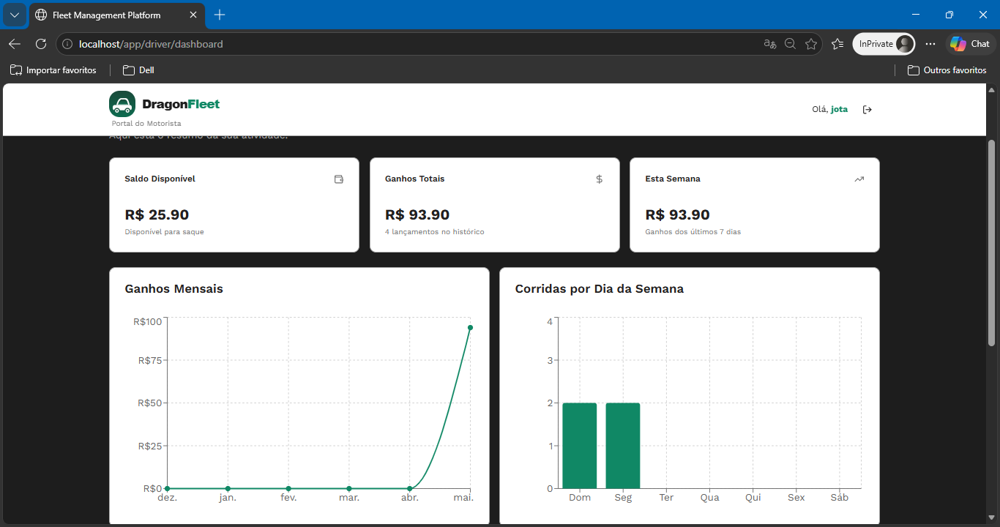
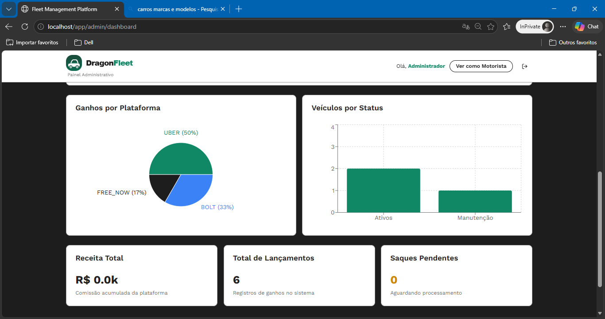
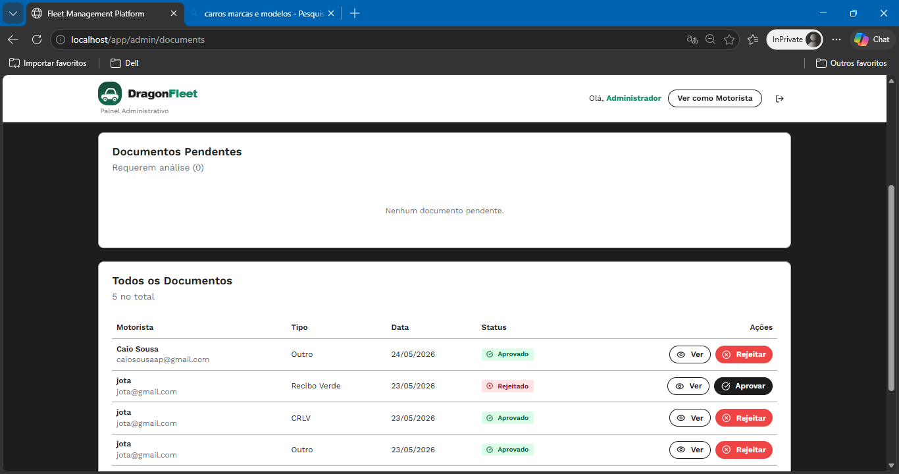
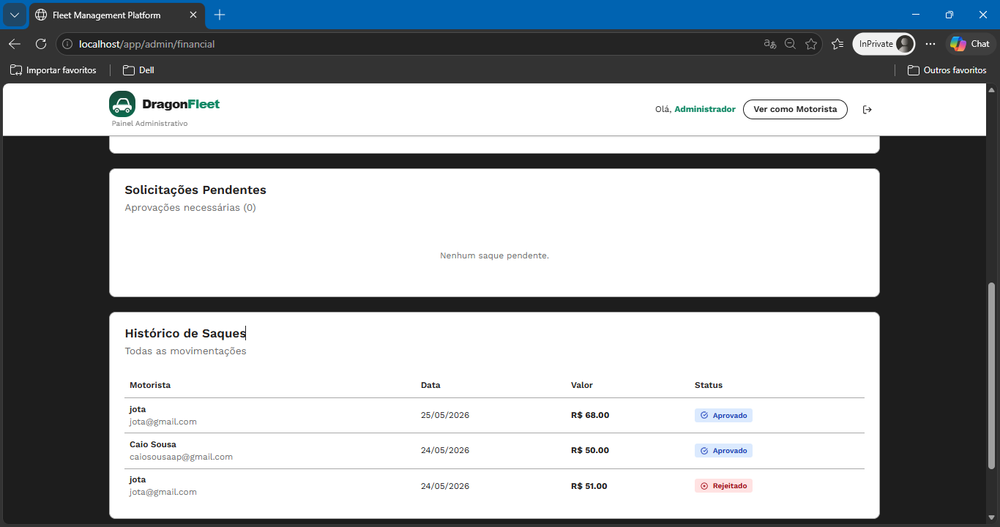

<div align="center">
  <h1>🐉 DragonFleet</h1>
  <p><strong>A full-stack fleet & driver management platform</strong></p>
  <p>Built with React, Node.js, PostgreSQL and Docker</p>

  <p>
    
    
    
    
    
  </p>
</div>

---

## 📸 Screenshots

> *(Add your screenshots/GIF here after capturing them)*

| Driver Dashboard | Admin Panel |
|---|---|
|  |  |

| Document Review | Financial Control |
|---|---|
|  |  |

---

## 🎯 Overview

DragonFleet is a complete platform for managing drivers and fleets, inspired by solutions like Bluewalk. Drivers can track their earnings, upload documents, and request withdrawals. Administrators have a full analytics dashboard with financial control, driver management, and document validation.

---

## ✨ Features

### 🚗 Driver Portal
- Register, login, and manage personal profile
- Upload documents (driver's license, vehicle docs, receipts)
- Log daily earnings by platform (Uber, Bolt, Free Now, etc.)
- Request balance withdrawals and track history
- Real-time notifications on document and withdrawal status

### 🛡️ Admin Panel
- Full driver management with status filtering
- Document review — approve or reject with notes
- Financial control — approve/reject withdrawals
- Fleet management — assign vehicles to drivers
- Analytics dashboard with charts and KPIs
- System settings (fees, limits, etc.)

---

## 🛠️ Tech Stack

| Layer | Technology |
|---|---|
| Frontend | React 18, TypeScript, TailwindCSS, shadcn/ui |
| State / Data | TanStack Query (React Query) |
| Backend | Node.js, Express, TypeScript |
| ORM | Prisma |
| Database | PostgreSQL 16 |
| Auth | JWT (JSON Web Token) |
| File Upload | Cloudinary |
| Charts | Recharts |
| Infrastructure | Docker, Docker Compose, Nginx |

---

## 🚀 Running Locally

### Prerequisites
- [Docker](https://www.docker.com/) and Docker Compose
- [Node.js 18+](https://nodejs.org/)

### 1. Clone the repository
```bash
git clone https://github.com/eliasneto072/DragonFleet.git
cd DragonFleet
```

### 2. Set up environment variables

Create a `.env` file at the root (based on the example below):

```env
# Database
POSTGRES_USER=postgres
POSTGRES_PASSWORD=yourpassword
POSTGRES_DB=yourDB

# Backend
JWT_SECRET=your_jwt_secret
JWT_EXPIRES_IN=1h


# Cloudinary
CLOUD_NAME=your_cloud_name
API_KEY=your_api_key
API_SECRET=your_api_secret

# Frontend
VITE_API_URL=http://localhost:3000
```

### 3. Start all services
```bash
docker-compose up -d
```

This starts:
- **PostgreSQL** on port `5433`
- **Backend API** on port `3000`
- **Frontend** on port `80`

### 4. Run database migrations
```bash
cd backend
npm install
npx prisma migrate deploy
```

### 5. Create an admin user
```bash
npx ts-node prisma/seed-admin.ts
```

### 6. Access the app
- Frontend: [http://localhost](http://localhost)
- API: [http://localhost:3000](http://localhost:3000)
- Prisma Studio: `npx prisma studio` (connects to Docker DB on port 5433)

---

## 📁 Project Structure

```
DragonFleet/
├── backend/
│   ├── prisma/
│   │   ├── schema.prisma
│   │   └── seed-admin.ts
│   └── src/
│       ├── modules/
│       │   ├── auth/
│       │   ├── users/
│       │   ├── earnings/
│       │   ├── withdrawals/
│       │   ├── documents/
│       │   ├── vehicles/
│       │   ├── notifications/
│       │   └── analytics/
│       ├── middlewares/
│       └── shared/
└── frontend/
    └── src/
        ├── app/
        │   ├── components/
        │   │   ├── admin/
        │   │   └── driver/
        │   └── router/
        ├── features/
        │   ├── admin/
        │   ├── driver/
        │   ├── auth/
        │   └── landing/
        └── shared/
```

---

## 🔌 API Endpoints

| Method | Endpoint | Description |
|---|---|---|
| POST | `/auth/register` | Register a new driver |
| POST | `/auth/login` | Authenticate and get JWT |
| GET | `/auth/me` | Get current user profile |
| GET | `/earnings` | List earnings |
| POST | `/earnings` | Log a new earning |
| GET | `/withdrawals` | List withdrawals |
| POST | `/withdrawals` | Request a withdrawal |
| PATCH | `/withdrawals/:id/status` | Approve or reject (admin) |
| GET | `/documents` | List documents |
| POST | `/documents` | Upload a document |
| PATCH | `/documents/:id/status` | Approve or reject (admin) |
| GET | `/analytics/stats` | Platform statistics (admin) |

---

## 📄 License

This project is licensed under the MIT License.

---

<div align="center">
  <p>Built by <a href="https://github.com/eliasneto072">Elias</a></p>
</div>
