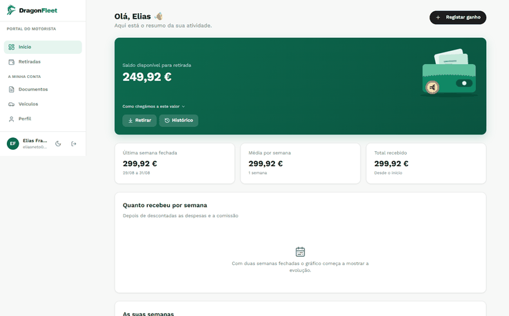
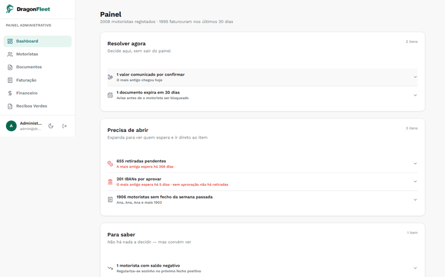

<div align="center">


# DragonFleet

**Gestão de frota e motoristas TVDE**

Plataforma de fecho semanal para uma frota Uber e Bolt em Portugal.
O motorista vê o que ganhou e pede o que lhe cabe; o escritório fecha a semana,
aprova documentos e controla o dinheiro.


</div>

---

## Duas aplicações, um sistema

O DragonFleet não é um produto para qualquer frota. É a plataforma de um
operador concreto, e isso explica quase todas as decisões que se seguem.

### Portal do motorista

Ele vê quanto entrou em cada plataforma, quanto saiu em despesas e quanto fica
para si. Envia documentos, regista o IBAN e pede retiradas.

<div align="center">
  
</div>

### Painel de administração

Uma fila de trabalho, não um mostruário de números. O que precisa de decisão
aparece primeiro, com quem está à espera e há quanto tempo.

<div align="center">
  
</div>

---

## A regra que explica o resto

> *"Motorista fez 100€ Uber e 100€ Bolt, isso dá 200€; gastou 50€ em gasóleo e
> 50€ em via verde, o resultado é 100€; a percentagem vai ser sobre os 100€ de
> lucro e não dos 200€."*

A comissão da empresa incide sobre o **lucro**, não sobre o bruto. Tudo o resto
— o saldo, as retiradas, os relatórios — deriva daqui.

Os detalhes e os invariantes estão em
**[docs/01-visao-geral.md](./docs/01-visao-geral.md)**.

---

## Começar

```bash
git clone https://github.com/eliasneto072/DragonFleet.git
cd DragonFleet

cp backend/.env.example backend/.env    # preencher; ver docs/06-desenvolvimento.md
docker compose up -d --build

docker compose exec -e SEED_ADMIN_EMAIL=admin@dragonfleet.com \
  -e SEED_ADMIN_PASSWORD=umaSenhaForte123 backend node dist/scripts/seed-admin.js
```

O frontend fica em `http://localhost` e a API em `http://localhost:3000`.

---

## Documentação

| | |
|---|---|
| **[01 · Visão geral](./docs/01-visao-geral.md)** | O que é, para quem, e o modelo de negócio |
| **[02 · Portal do motorista](./docs/02-portal-do-motorista.md)** | As cinco telas, uma a uma |
| **[03 · Painel de administração](./docs/03-painel-de-administracao.md)** | As dez telas, uma a uma |
| **[04 · Arquitetura](./docs/04-arquitetura.md)** | Stack, estrutura e as decisões que a moldaram |
| **[05 · Publicação](./docs/05-deploy.md)** | Render + Cloudflare Pages, passo a passo |
| **[06 · Desenvolvimento](./docs/06-desenvolvimento.md)** | Correr, testar e contribuir |

---

<div align="center">


Construído por **[Elias Neto](https://github.com/eliasneto072)** ·
[eliasneto072.github.io/vertice](https://eliasneto072.github.io/vertice/)

Do banco de dados à interface: backend, front-end, infraestrutura e publicação.

</div>
