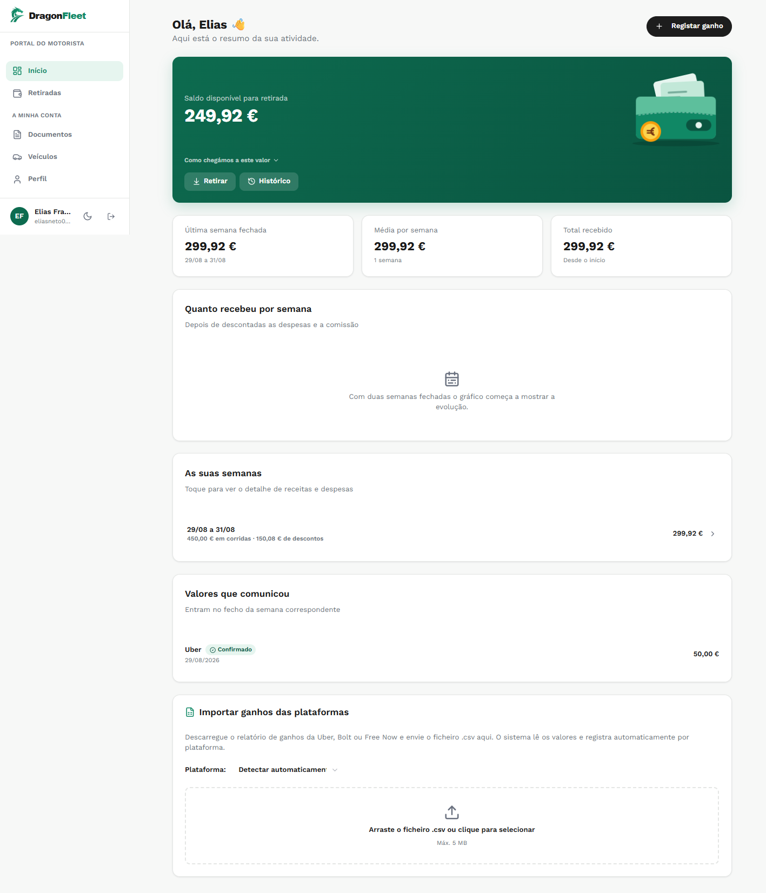
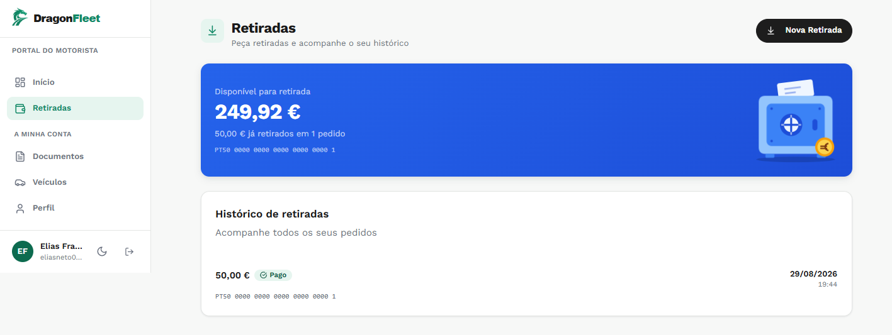
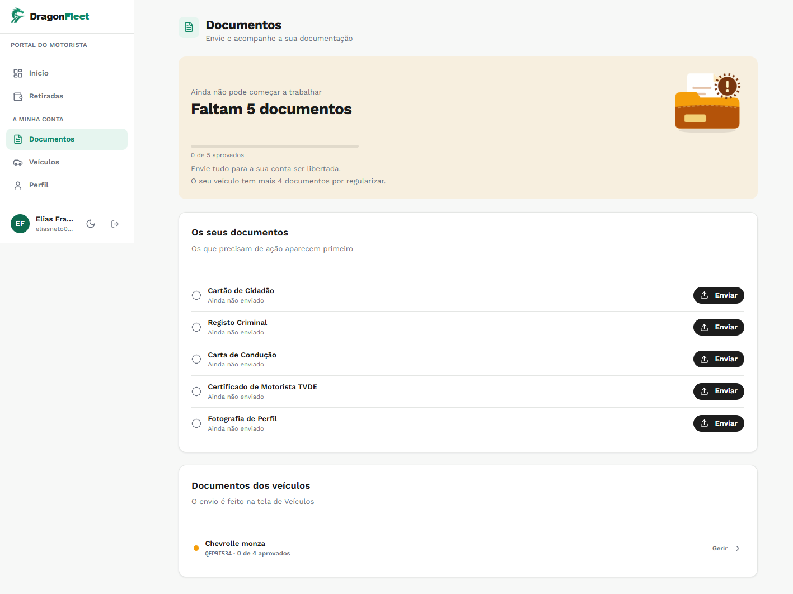
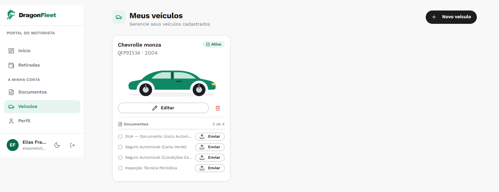
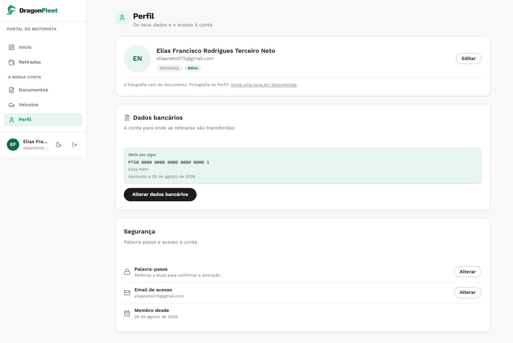
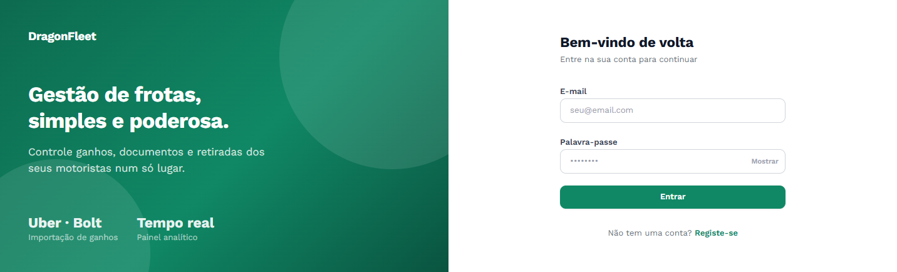
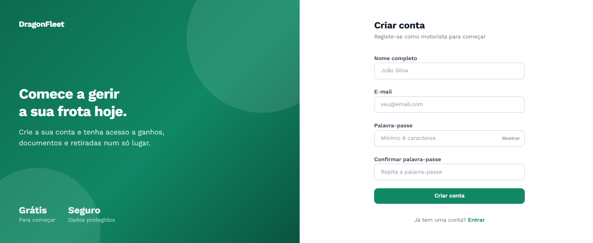

# 02 · Portal do motorista

Cinco telas. O motorista entra em `/app/driver` e é para aqui que o registo
público o encaminha.

  

---

## Início

`/app/driver/dashboard` · `features/driver/pages/DriverDashboardPage.tsx`

O cartão verde tem o saldo disponível e dois botões: **Retirar** e **Histórico**.
Por baixo, "Como chegámos a este valor" abre a decomposição — existe porque um
saldo que aparece sem explicação é a primeira coisa que gera um ticket de
suporte.

Os três números seguintes — última semana fechada, média por semana, total
recebido — são todos derivados de fechos. Nenhum vem de lançamentos.

**"Quanto recebeu por semana"** só desenha o gráfico a partir de duas semanas
fechadas. Com uma só, mostra a explicação em vez de uma linha reta que não diz
nada.

**"As suas semanas"** é a lista de fechos, com receita e descontos por linha, e
abre o detalhe ao toque.

**"Valores que comunicou"** são os lançamentos, com o estado da conferência. Vale
repetir: estes **não creditam**. O rótulo diz "Entram no fecho da semana
correspondente" por causa disso.

**"Importar ganhos das plataformas"** aceita o CSV da Uber, Bolt ou Free Now.

> Esta última secção está na tela errada por decisão adiada. O combinado é que o
> admin receba os ficheiros dos portais e confira; ficou aqui até existir a
> receção do lado da administração. Ver o P2 nº7 no
> [CONTEXTO-DRAGONFLEET.md](../CONTEXTO-DRAGONFLEET.md).

---

## Retiradas

`/app/driver/withdrawals` · `features/driver/pages/WithdrawalsPage.tsx`

O cartão azul mostra o disponível, quanto já foi retirado e o IBAN de destino.
O saldo aparece aqui de propósito: antes, o motorista escolhia o valor às cegas
e levava `INSUFFICIENT_BALANCE` depois de preencher tudo.

**Nova Retirada** pede o valor e o **recibo verde**, obrigatório. O pedido segue
em multipart pelo `apiClient.upload()`.

Se não houver IBAN aprovado, o botão fica desativado com aviso e atalho para o
Perfil. Deixar preencher o valor e anexar o recibo para depois recusar é a pior
versão disto.

O histórico mostra o IBAN gravado em cada pedido — o que estava em vigor à data,
não o atual.

---

## Documentos

`/app/driver/documents` · `features/driver/pages/DocumentsPage.tsx`

A faixa no topo diz o que falta e o que isso impede: *"Ainda não pode começar a
trabalhar"*. É a tela que decide se a conta está libertada.

Os cinco documentos pessoais estão aqui. Os do veículo aparecem em baixo, mas o
envio é feito na tela de Veículos — a ligação diz isso em vez de deixar o
motorista à procura.

A ordem não é alfabética: o que precisa de ação aparece primeiro.

---

## Veículos

`/app/driver/vehicles` · `features/driver/pages/VehiclesPage.tsx`

A viatura associada, com matrícula, ano e o contador de documentos aprovados.
Os quatro documentos do veículo enviam-se daqui.

---

## Perfil

`/app/driver/profile` · `features/driver/pages/ProfilePage.tsx`

**Dados bancários** vivem aqui, e não na tela de Documentos — misturar cartão de
cidadão com meio de pagamento confunde duas coisas diferentes.

A secção mostra os quatro estados que o backend distingue:

| Estado | O que aparece |
|---|---|
| Sem IBAN | Formulário de submissão |
| Pendente | O em vigor e o submetido, lado a lado |
| Recusado | O motivo dado pela administração |
| Em vigor | O IBAN, o titular e a data de aprovação |

Em **Segurança**, alterar a palavra-passe ou o email exige a palavra-passe atual.
Sem isso, possuir o token bastava para trocar as duas — e como o email é o canal
de recuperação, o dono legítimo ficava sem caminho de volta. O token vive no
`localStorage`, portanto uma sessão esquecida num computador partilhado era
suficiente.

A fotografia vem do documento "Fotografia de Perfil" e não de um upload próprio,
para não haver duas imagens a divergir.

---

## Ainda por corrigir nestas telas

**O painel esquerdo do login e do registo fala ao gestor.** O login diz
*"Controle ganhos, documentos e retiradas dos seus motoristas"* e o registo diz
*"Comece a gerir a sua frota hoje"* com um selo "Grátis". É o mesmo engano de
enquadramento que a página de entrada tinha antes de ser reescrita: quem se
regista é um motorista, não alguém a montar uma frota.

