# 03 · Painel de administração

Dez telas, em `/app/admin`. As capturas são de um ambiente com dois mil
motoristas de teste — os números grandes são disso.

  

---

## Painel

`/app/admin/dashboard` · `features/admin/pages/AdminDashboardPage.tsx`

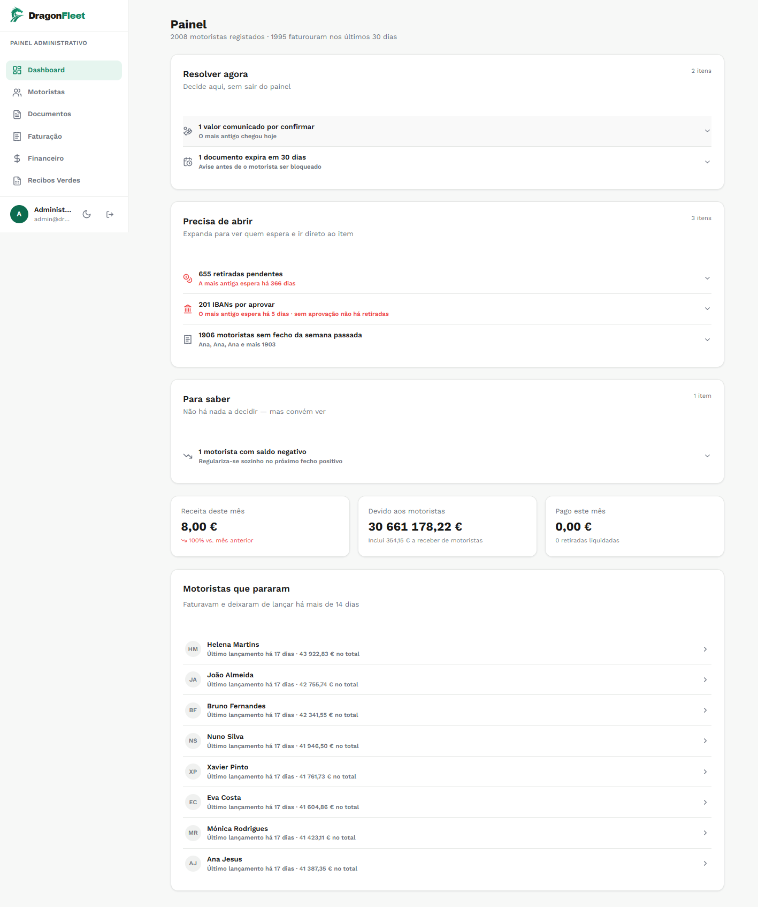

Uma fila de trabalho, e não um mostruário de números. As pendências estão
agrupadas por **urgência de decisão**, não por tipo:

**Resolver agora** — decide-se ali, sem sair do painel.
**Precisa de abrir** — expande e vai direto ao item, com quem espera e há quanto.
**Para saber** — não há nada a decidir, mas convém ver.

O terceiro grupo existe por uma razão específica. Um motorista com saldo negativo
não é um problema: regulariza-se sozinho no próximo fecho positivo. Se ficasse
misturado com as retiradas por aprovar, alguém tentaria "resolvê-lo".

Os três números por baixo — receita do mês, devido aos motoristas, pago este mês
— vêm dos fechos. O "Devido aos motoristas" já somou a tabela de ganhos, do tempo
em que o motorista lançava o próprio saldo; inflava com valores que não eram
dívida e ignorava os fechos.

**"Motoristas que pararam"** lista quem faturava e deixou de lançar há mais de
catorze dias.

---

## Motoristas

`/app/admin/drivers` · `features/admin/pages/DriversPage.tsx`

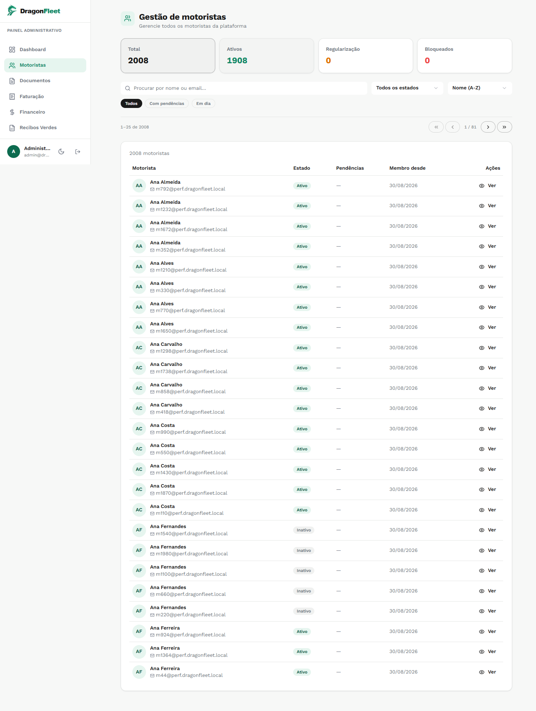

Lista paginada com procura, filtro de estado e ordenação. Os separadores
**Todos / Com pendências / Em dia** são o caminho rápido para quem precisa de
atenção.

A paginação é do servidor. Com dois mil registos, trazer tudo e filtrar no
browser deixa de funcionar muito antes disso.

O registo é público e a conta nasce **ativa**. A decisão foi essa: qualquer
pessoa pode criar conta, e quem não pertence à frota é desativado aqui.

---

## Documentos

`/app/admin/documents` · `features/admin/pages/DocumentsAdminPage.tsx`

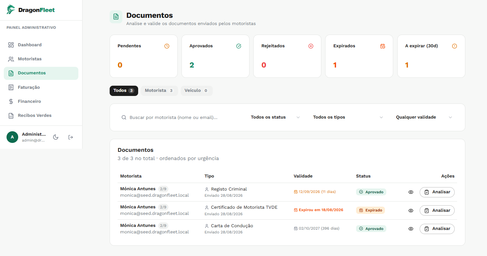

Ordenados por urgência: expirados primeiro, depois a expirar, depois pendentes.

**Analisar** abre a revisão, onde se aprova ou recusa **e se preenche a
validade**. A validade não vem do motorista de propósito — ele escreveria a data
que lhe desse jeito, e é dessa data que depende o aviso de caducidade.

---

## Faturação

`/app/admin/settlements` · `features/admin/pages/SettlementsPage.tsx`

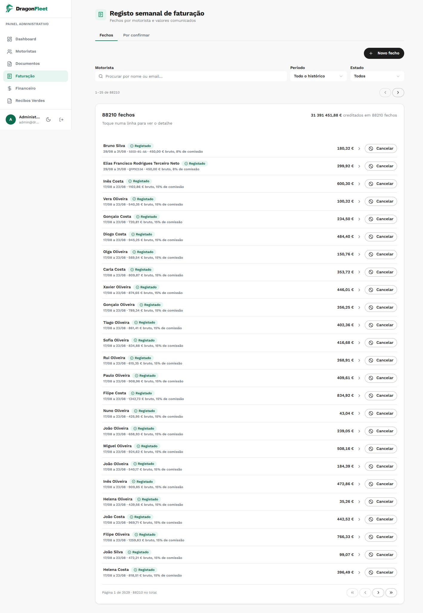

O coração do sistema. Dois separadores:

**Fechos** — o histórico. Cada linha traz o período, a matrícula, o bruto e a
percentagem aplicada *naquele fecho*. É por isso que se lê "8% de comissão" numa
linha e "15%" noutra: cada uma gravou a sua.

**Por confirmar** — os valores que os motoristas comunicaram, à espera de
conferência.

**Novo fecho** abre o formulário: receitas por plataforma, despesas por
categoria, e o resultado calculado à frente enquanto se escreve.

**Cancelar** estorna. Um fecho errado não se apaga — desfaz-se, e o rasto fica.

---

## Financeiro

`/app/admin/financial` · `features/admin/pages/FinancialPage.tsx`

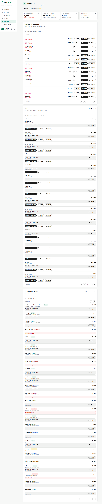

Três blocos, pela ordem em que o dinheiro se move:

**Retiradas por processar** — quem espera há mais tempo aparece primeiro.
Aprovar, rejeitar, ver o recibo.

**Por transferir** — as aprovadas, com o IBAN e o titular à vista e um botão de
copiar. É daqui que o administrador leva o IBAN para o banco.
**Marcar como paga** é o que separa uma retirada aprovada de uma já transferida.
Sem esse passo, as duas são indistinguíveis e o indicador "Pago este mês" fica
sempre a zero.

**Histórico** — tudo, com o motivo das rejeições à vista.

O separador **Dados bancários** é onde os IBANs submetidos são aprovados ou
recusados, ao lado de onde o dinheiro sai.

---

## Recibos Verdes

`/app/admin/green-receipts` · `features/admin/pages/GreenReceiptsPage.tsx`

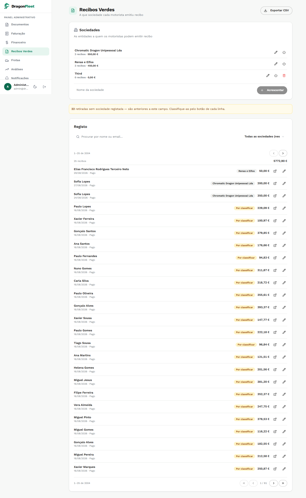

A que sociedade cada motorista emitiu recibo. Em cima, as sociedades; em baixo, o
registo, com exportação para CSV.

O aviso amarelo — *"22 retiradas sem sociedade registada"* — é honesto sobre a
migração: são anteriores ao campo existir, e classificam-se linha a linha.
Preencher automaticamente com a primeira sociedade da lista seria inventar
informação fiscal.

---

## Frotas

`/app/admin/fleet` · `features/admin/pages/FleetPage.tsx`

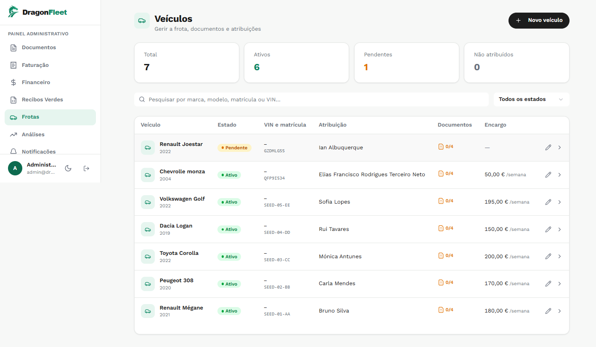

As viaturas, com estado, VIN, matrícula, motorista atribuído, contador de
documentos e o encargo semanal. Esse encargo entra nas despesas do fecho, ao lado
da Via Verde e do combustível.

A ficha de cada viatura guarda o histórico de atribuições — quem a conduziu e
quando.

---

## Análises

`/app/admin/analytics` · `features/admin/pages/AnalyticsPage.tsx`

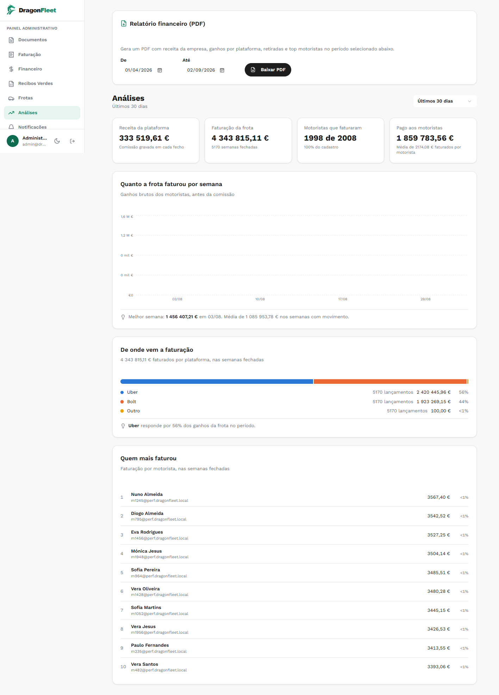

**Relatório financeiro (PDF)** no topo, com intervalo de datas.

Quatro indicadores, e a distinção entre eles importa: **receita da plataforma** é
a comissão gravada nos fechos, o que a empresa ganhou; **faturação da frota** é o
bruto dos motoristas, que passa por eles. Confundir os dois faz o negócio parecer
cinquenta vezes maior.

Depois, faturação por semana, repartição por plataforma e o top de motoristas.

O PDF usa a comissão gravada em cada fecho, e não a das Configurações. Um
relatório de março tem de continuar a dizer o que disse em março.

---

## Notificações

`/app/admin/notifications` · `features/admin/pages/NotificationsAdminPage.tsx`

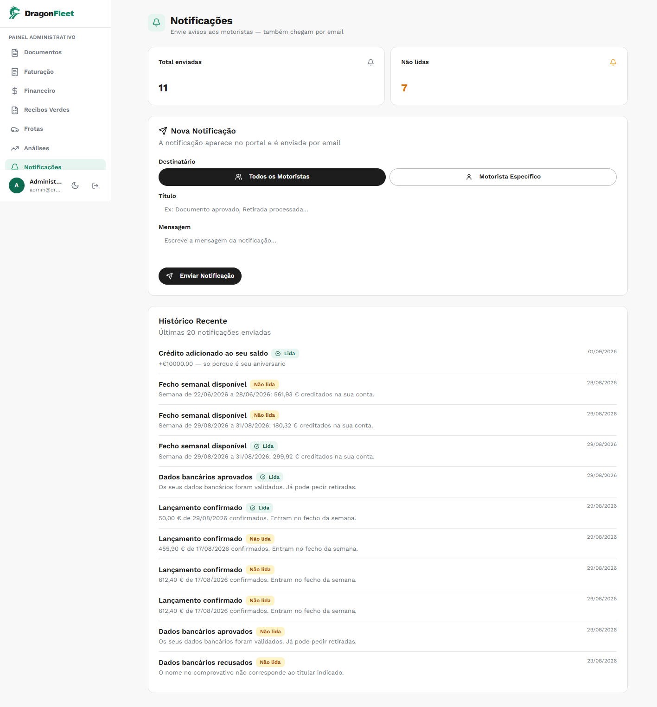

Avisos para todos os motoristas ou para um só. Aparecem no portal e seguem por
email.

O histórico mistura as manuais com as automáticas — fecho publicado, dados
bancários aprovados ou recusados, lançamento confirmado — porque do lado do
motorista chegam todas pelo mesmo sítio.

---

## Suporte

`/app/admin/support` · `features/admin/pages/SupportAdminPage.tsx`

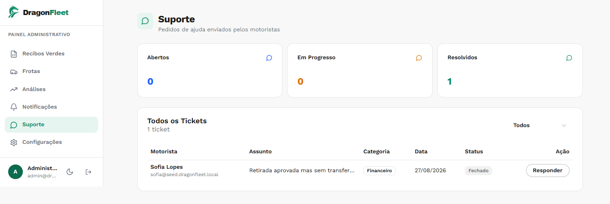

Os pedidos de ajuda, por estado e categoria.

---

## Configurações

`/app/admin/settings` · `features/admin/pages/SettingsPage.tsx`

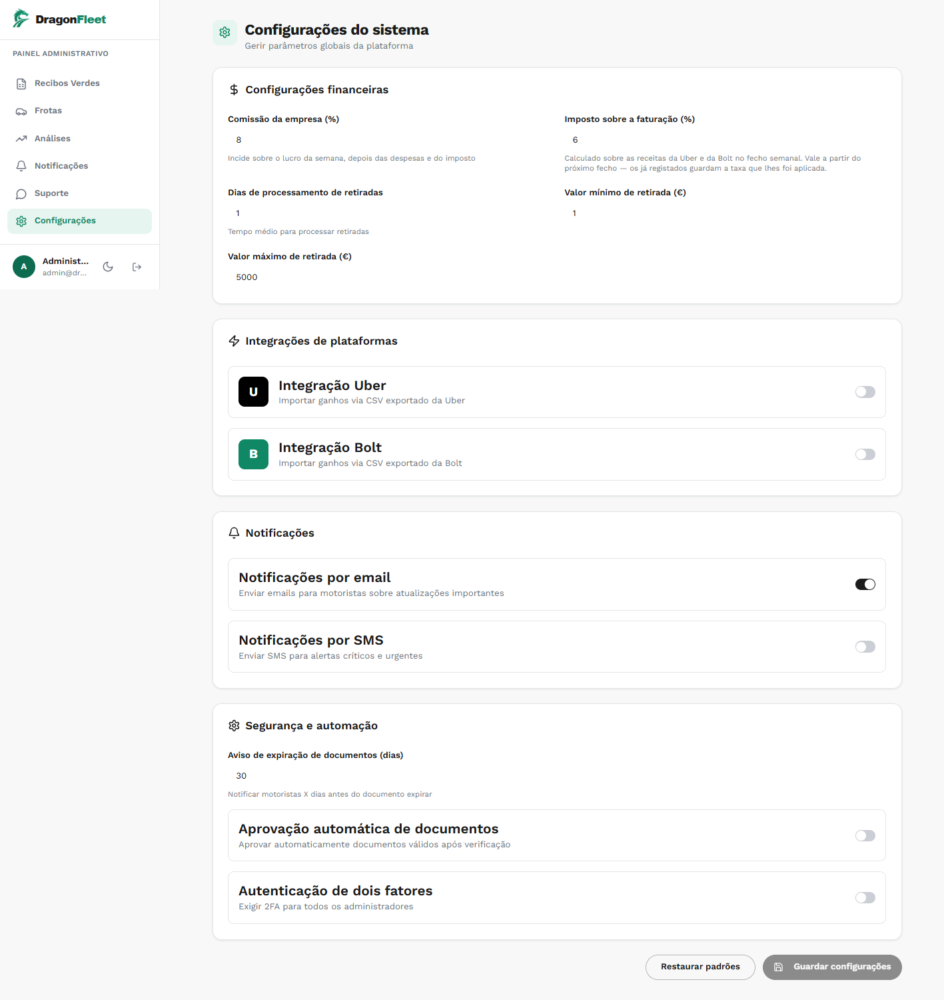

**Comissão da empresa (%)** — incide sobre o lucro da semana, depois das despesas
e do imposto.

**Imposto sobre a faturação (%)** — sobre as receitas da Uber e da Bolt.

O texto de ajuda deste último merece atenção: *"Vale a partir do próximo fecho —
os já registados guardam a taxa que lhes foi aplicada."* Não é um pormenor de
interface; é o invariante dos valores congelados escrito onde alguém o vai ler
antes de mudar o número.

Mais abaixo: mínimo e máximo de retirada, dias de processamento, alternadores das
integrações, notificações, e o aviso de expiração de documentos em dias.
